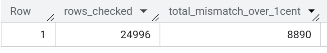

# Case Study – Retail Data Validation & Cleaning

## Problem
Before analysing BrightMart sales and customer behaviour, it was necessary to validate data quality to ensure reporting metrics were reliable and comparable across online and in-store channels.

## Dataset
Simulated omnichannel retail **customer master data** and **transaction records** containing purchase history, delivery channels, discounts, and engagement attributes.

## Tools
BigQuery SQL

## What I Did
- Checked **referential integrity** by identifying transactions referencing non-existent CustomerIDs.
- Quantified **NULL values across critical fields** in both customer and transaction tables to assess data completeness.
- Validated **financial consistency** by detecting mismatches between subtotal, discount, and total values, and created a reusable clean view for downstream analysis.

## Key Insights
Customer master data showed no **NULLs** across core attributes (age, loyalty tier, engagement scores), indicating strong data completeness for segmentation analysis.
**8,890 out of 24,996 transactions** showed pricing mismatches (>1 cent), highlighting delivery fee and channel-based variations affecting total calculations.
Created a clean analytical view (v_transactions_clean) enabling consistent revenue comparisons across channels and supporting accurate dashboards and segmentation.

## Output Snapshot

*The snapshot illustrates NULL audits, PK checks, and mismatch counts used to evaluate data reliability.*
