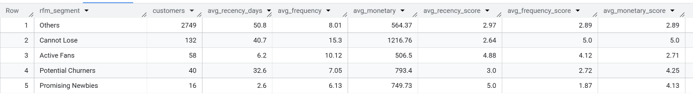

# Case Study – Retail Customer Segmentation (RFM Analysis)

## Problem
BrightMart, an omnichannel retail business, needed a simple analytical method to identify high-value customers and customers at risk of churn to support targeted marketing and retention strategies.

## Dataset
Simulated retail customer and transaction dataset containing purchase history, delivery channels, and customer engagement attributes.

## Tools
BigQuery SQL

## What I Did
- Built an RFM base table per customer calculating **Recency (days since last purchase), Frequency (number of receipts), and Monetary (total spend)**.
- Applied **NTILE(5) window functions** to score each customer into quintiles for R, F, and M dimensions.
- Created business-oriented customer segments (e.g., *Active Fans*, *Cannot Lose*, *Potential Churners*) using CASE logic and summarised KPIs per segment.


## Key Insights

- **“Cannot Lose” customers** showed the highest average spend ($1,216) and strong purchase frequency, indicating priority for retention campaigns.
- **“Active Fans”** demonstrated very recent activity (6 days recency) with consistent purchase behaviour, making them ideal for loyalty and cross-sell initiatives.
- **“Potential Churners”** displayed higher recency days and lower frequency, signalling the need for re-engagement strategies and targeted promotions.

## Output Snapshot


*The table summarises customer count, average recency, frequency, and monetary value per segment.*


## Key Query Snippet
```sql
NTILE(5) OVER (ORDER BY recency_days DESC) AS recency_score,
NTILE(5) OVER (ORDER BY frequency) AS frequency_score,
NTILE(5) OVER (ORDER BY monetary) AS monetary_score
